# 딥 러닝 프레임워크 Tensorflow 생성

## ****사전 작업****

### ****STEP 1. VPC 생성****

### ****STEP 2. Public Subnet 생성****
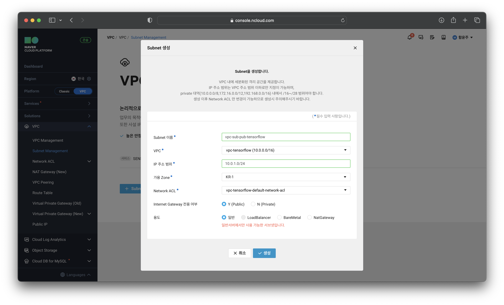

## ****서버 생성****

### ****STEP 1. 서버 이미지 선택****
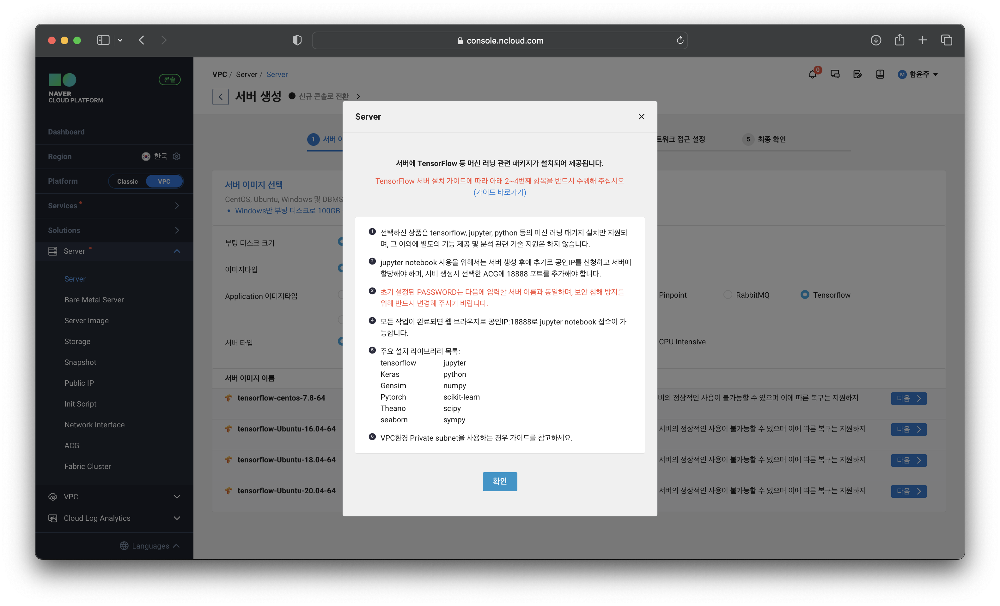

### ****STEP 2. 서버 설정****
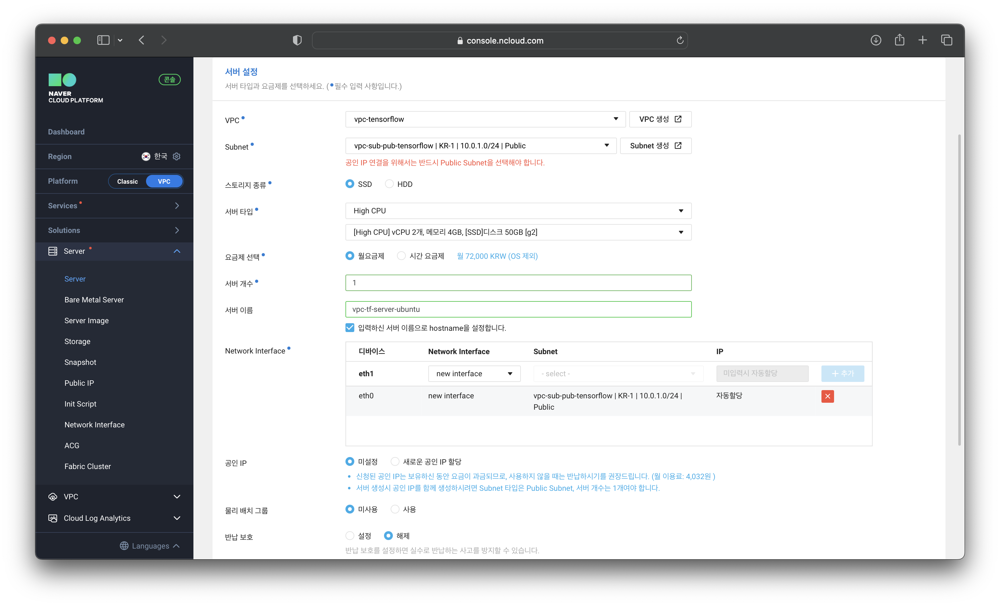

### ****STEP 3. 인증키 설정****
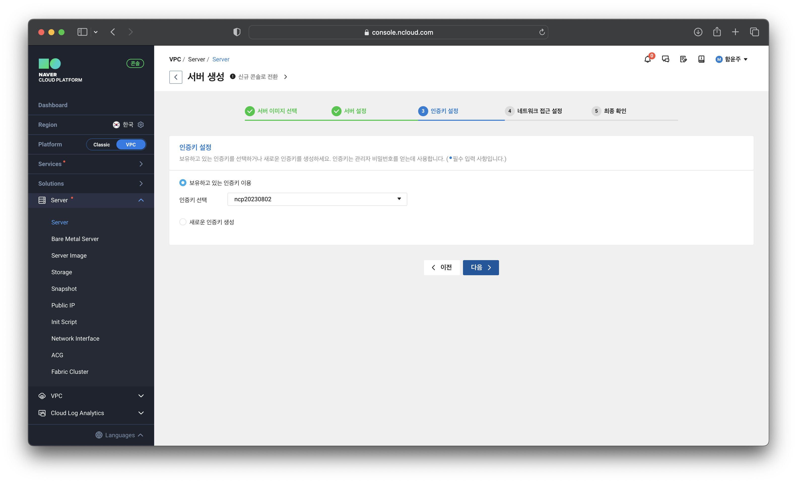

### ****STEP 4. 네트워크 접근 설정****

### ****STEP 5. 최종 확인****
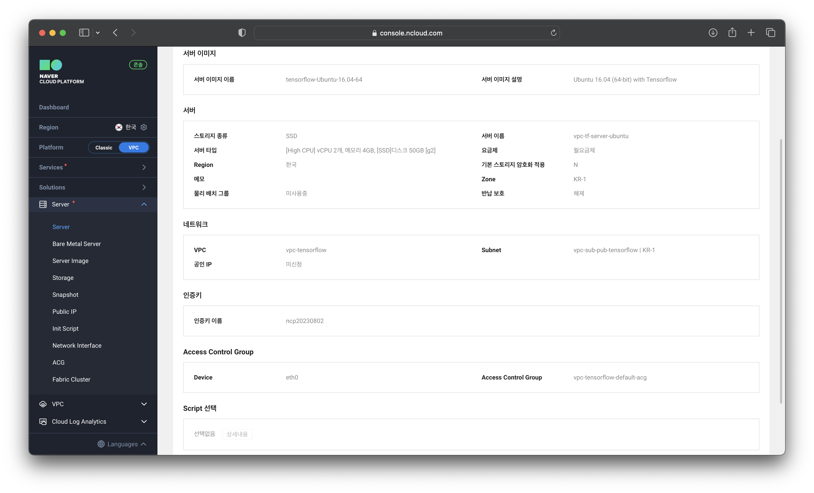

## ****서버 접속 환경 설정****

### ****STEP 1. 공인 IP 주소 신청****
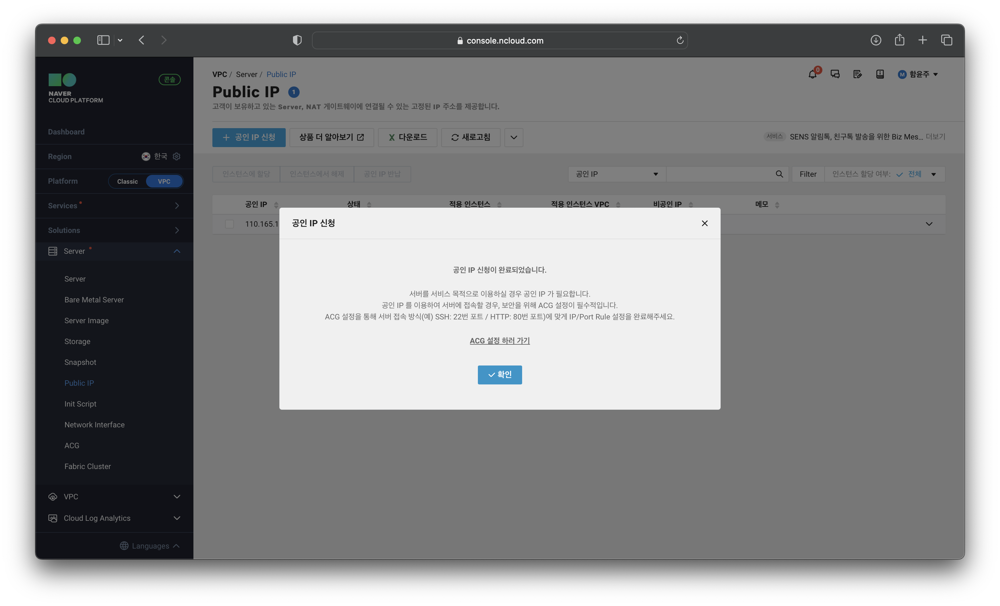

### ****STEP 2. ACG 설정****

### ****STEP 3. 관리자 비밀번호 확인****
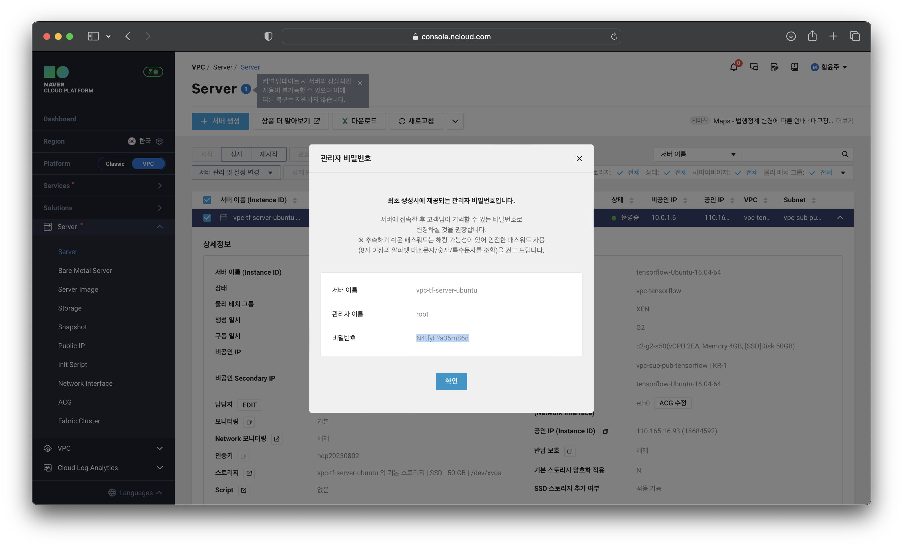

## ****서버 접속****

### ****STEP 1. 접속 정보 확인****

### ****STEP 2. 터미널 프로그램 접속****
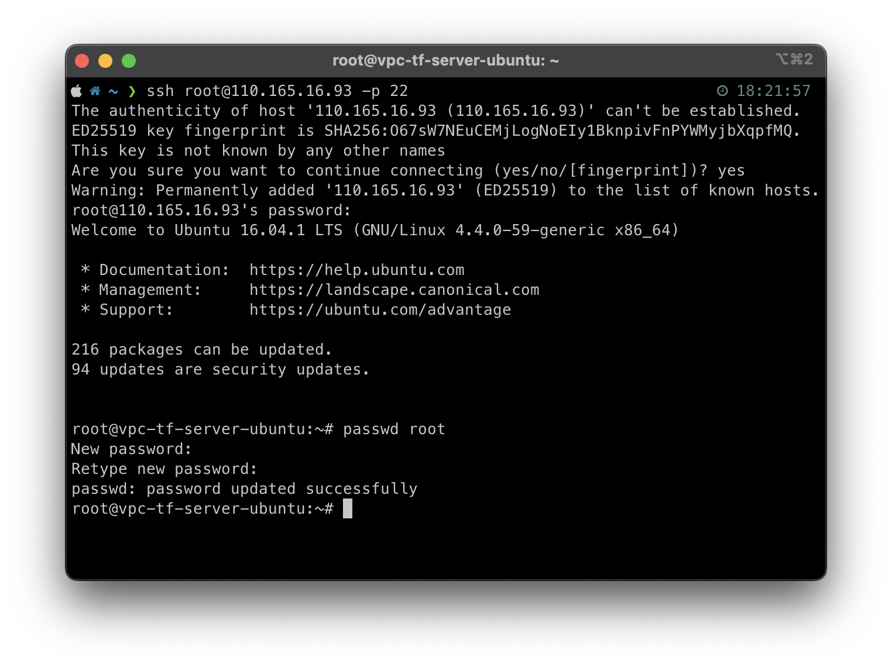

### ****STEP 3. Jupyter Notebook 비밀번호 변경****
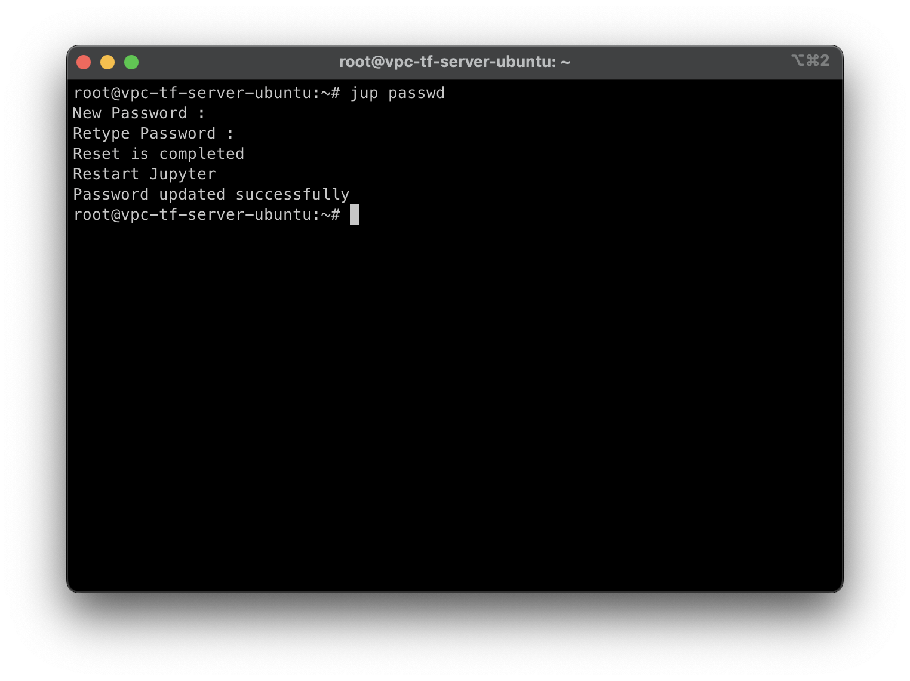

### ****STEP 4. Jupyter 프로세스 시작****
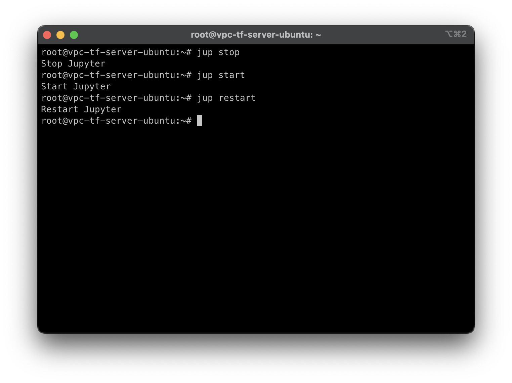

### ****STEP 5. TensorBoard 프로세스 시작****
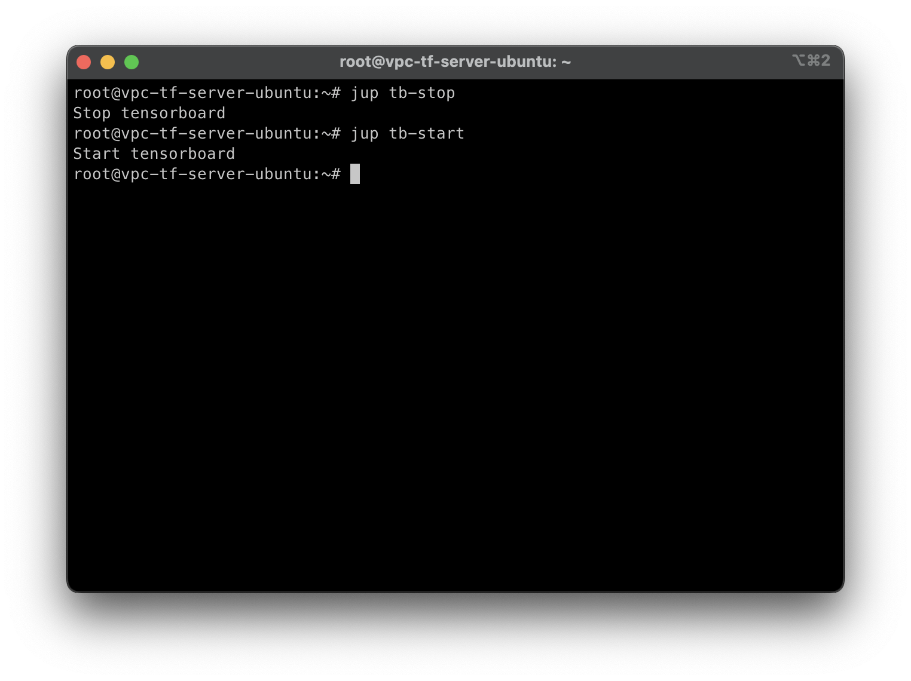

## ****신규 코드 작성****

### ****STEP 1. Jupyter Notebook Web 실행****
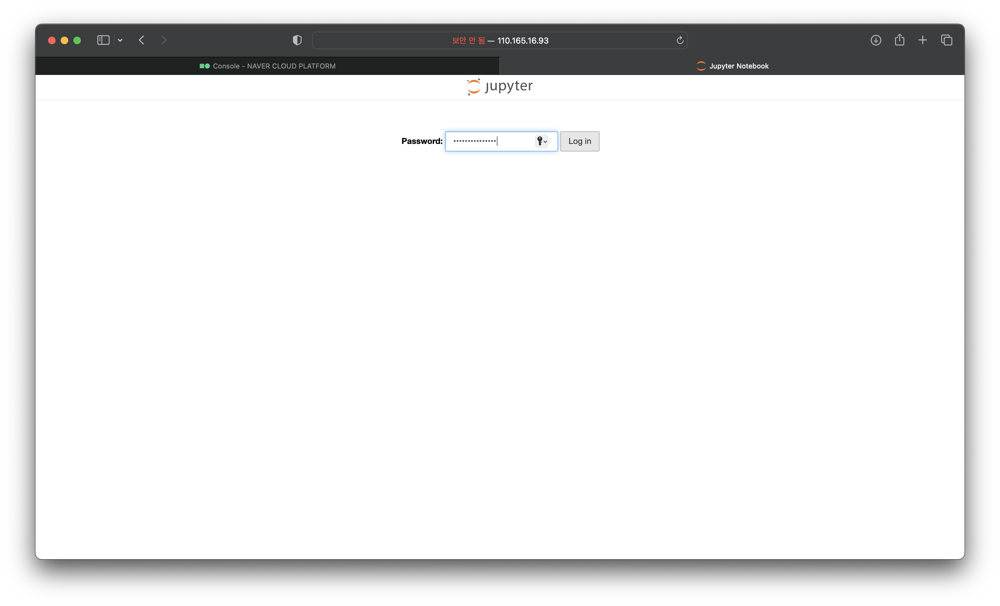

### ****STEP 2. 예제 코드 실행****
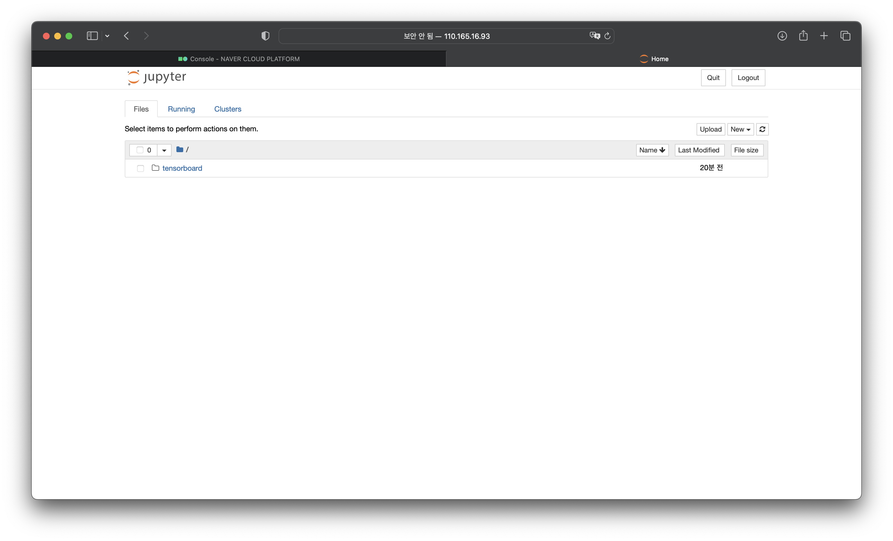

## ****서버 정지 및 반납****

### ****STEP 1. 서버 정지****
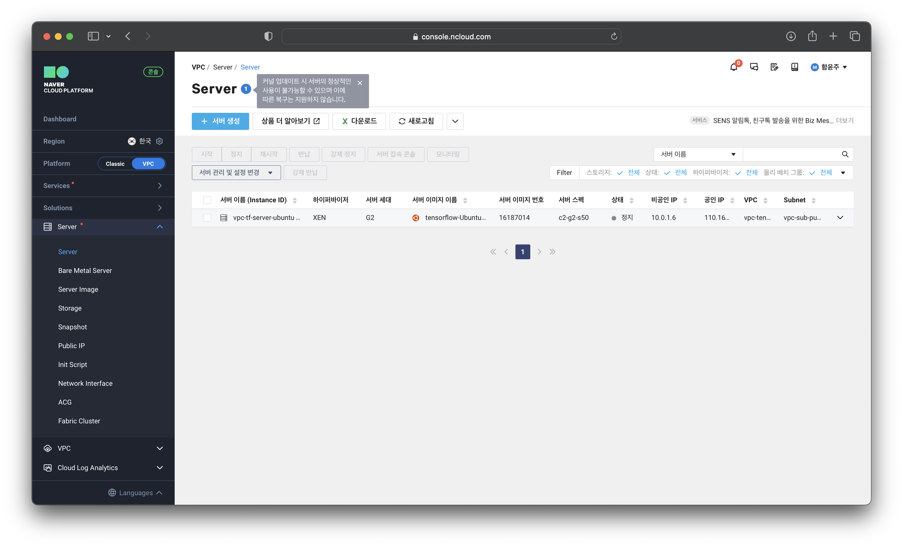

### ****STEP 2. 서버 반납****
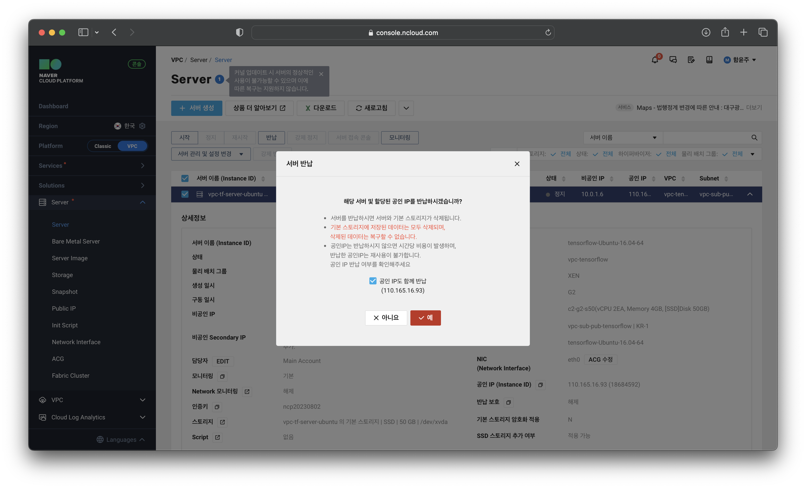